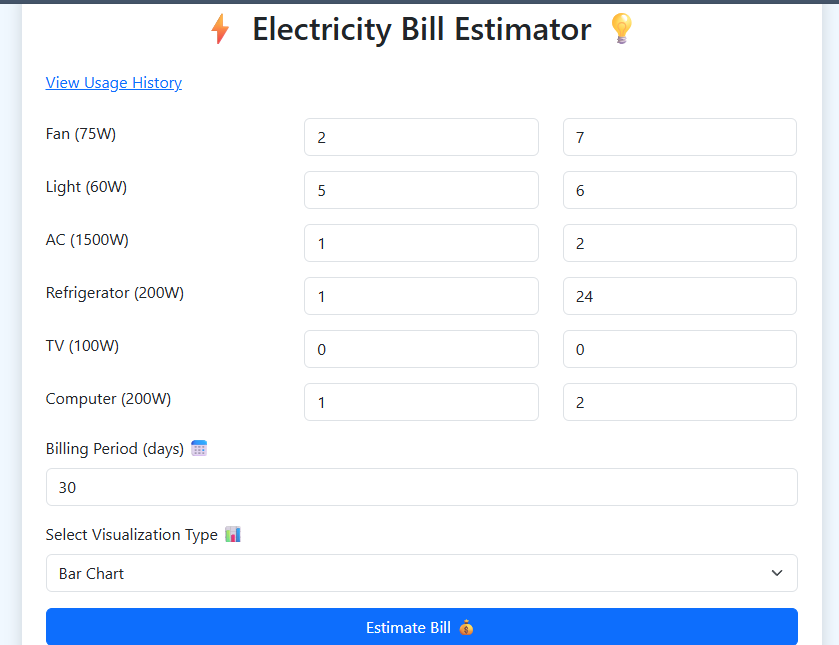
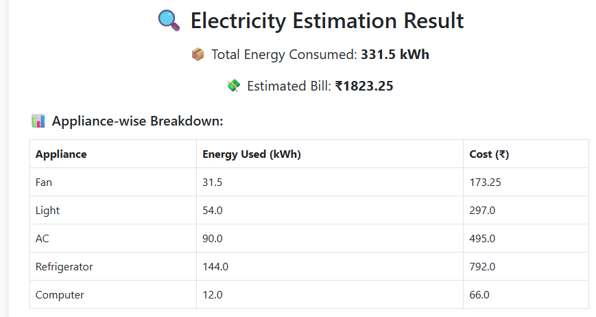
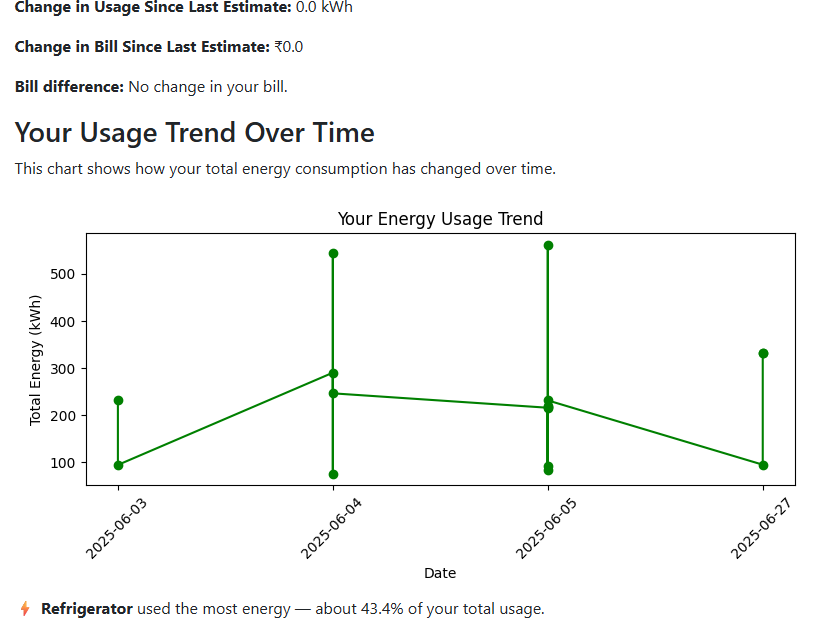

# ⚡ Electricity Bill Estimator

An offline web-based application that helps users estimate their monthly electricity bill based on appliance usage. The system allows appliance-level input, calculates energy consumption and cost, and provides visual insights like bar, pie, and bubble charts. User history is stored locally to help track consumption trends over time.

---

## 🚀 Features

- 🔐 User Login & Registration (Offline)
- 📦 Appliance-wise quantity and daily usage input
- ⚙️ Automatic bill estimation based on usage and appliance ratings
- 📊 Visualizations: Bar, Pie, Bubble charts
- 📈 Personalized usage history and trend detection
- 🧠 Insights like most energy-consuming appliance
- 🗃️ Local database using SQLite for persistence

---

## 🖥️ Technologies Used

- Python (Flask Framework)
- HTML, CSS (Bootstrap)
- Jinja2 (Flask templates)
- Matplotlib (for visualizations)
- SQLite (as a local DB)
- JavaScript (for dynamic form behavior)

---

## 🔧 Installation & Setup

1. **Clone the repository**
   ```bash
   git clone https://github.com/elizasjc/electricity-bill-estimator.git
   cd electricity-bill-estimator

2.  Install required packages
    bash
    pip install -r requirements.txt

3.  Run the application
    bash
    python app.py

4.  Open your browser and go to:
    bash
    http://localhost:5000

---


## 🧪 How to Use

1. **Register** a new account using a username and password.
2. **Log in** to your account to access the appliance form.
3. For each appliance:
   - Enter the **quantity** (number of devices).
   - Enter the **hours used per day**.
4. Enter the **billing period (in days)** — default is 30.
5. Choose a **chart type** for visualization:
   - Bar Chart
   - Pie Chart
   - Bubble Chart
6. Click on **"Estimate Bill 💰"** to see:
   - ✅ Total energy consumed (in kWh)
   - 💸 Estimated electricity bill
   - 📊 Appliance-wise energy and cost breakdown
   - 📈 Energy usage trend over time
   - 💡 Most energy-consuming appliance
7. You can also click on **"View Usage History"** to check previous bills and trends.

---

## 📷 Screenshots

### 📝 Input Form


### ⚡ Estimation Result


### 📈 Usage Trend



---

## 🔮 Future Enhancements

- 📤 **Export as PDF**  
  Allow users to download the estimation results and charts as a PDF report.

- 🌙 **Dark Mode Toggle**  
  Enable switching between light and dark UI themes for better user experience.

- 💾 **Save Appliance Profiles**  
  Let users save frequently used appliance configurations for faster estimation.

- 🔔 **Smart Tips**  
  Suggest power-saving recommendations based on usage patterns.

- 📧 **Email Notifications**  
  Email users their monthly usage summary and bill estimate.

- 🔍 **Advanced Analytics Dashboard**  
  Add Power BI-like embedded dashboards to explore detailed trends.

- ☁️ **Cloud-based User Login**  
  Move from local SQLite to a cloud database to allow access from multiple devices.

- 📱 **Mobile Responsive Design**  
  Enhance UI layout and usability for smartphones and tablets.

- 🧠 **Machine Learning Predictions**  
  Integrate ML models to forecast future energy usage and cost.


---

## 📁 Database Structure

This project uses a local **SQLite** database named `users.db` with the following tables:

---

### 🧑‍💼 `users` Table

Stores registered user credentials.

| Column Name | Data Type | Description               |
|-------------|-----------|---------------------------|
| `id`        | INTEGER   | Primary Key (Auto-increment) |
| `username`  | TEXT      | Unique username for login |
| `password`  | TEXT      | Hashed password (secure)  |

---

### 📊 `usage_history` Table

Stores appliance usage history per user.

| Column Name      | Data Type | Description                                      |
|------------------|-----------|--------------------------------------------------|
| `id`             | INTEGER   | Primary Key (Auto-increment)                     |
| `username`       | TEXT      | Reference to user (foreign key-like)             |
| `timestamp`      | TEXT      | Date and time of the estimation (auto-inserted)  |
| `appliance_data` | TEXT      | JSON-formatted data of appliance usage           |
| `total_energy`   | REAL      | Total energy consumed in kWh                     |
| `estimated_bill` | REAL      | Estimated electricity cost in ₹                  |

---

> ⚠️ **Note:** All data is stored locally and securely, suitable for offline academic use.


---

## 👩‍💻 Author

**Shilpa J Chethalen**  
🎓 Postgraduate Student – M.Sc. Data Science  
💼 Passionate about data-driven applications and smart utilities  
📍 Based in India  
🔗 GitHub: [elizasjc](https://github.com/elizasjc)

